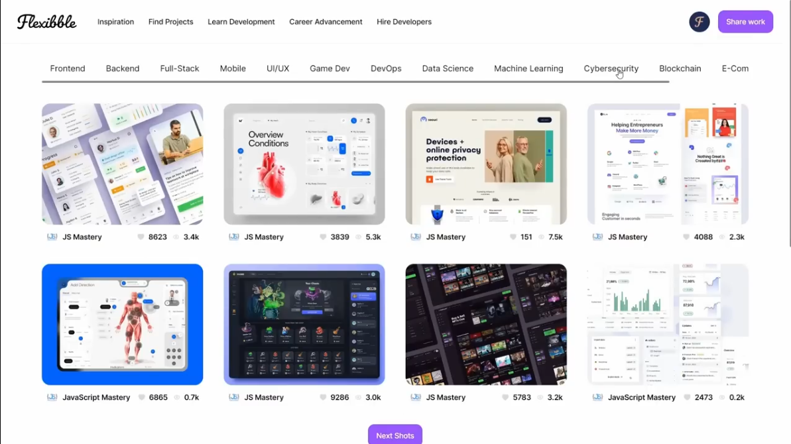

<div align="center">
  
[](https://twitter.com/intent/follow?screen_name=iamt_toby)
[](https://github.com/richdede)
[](https://www.linkedin.com/in/dee-prince-dede-970913217/)

  <br />
  <br />

  <h2 align="center">>A Full Stack Dribble Clone</h2>

  <a href="https://richard-ryan-mu.vercel.app/"><strong>➥ Live Demo</strong></a>

</div>

<br />

### Demo Screeshots



## 📋 <a name="table">Table of Contents</a>

1. 🤖 [Introduction](#introduction)
2. ⚙️ [Tech Stack](#tech-stack)
3. 🔋 [Features](#features)
4. 🤸 [Quick Start](#quick-start)
5. 🕸️ [Snippets](#snippets)
6. 🔗 [Links](#links)
7. 🚀 [More](#more)

## <a name="introduction">🤖 Introduction</a>

A full stack Dribble clone developed using Next.js, GraphQL, Next Auth, TypeScript, and tailwindcss features all the necessary features of dribble from sharing and showcasing projects.

If you're getting started and need assistance or face any bugs, contact me!

## <a name="tech-stack">⚙️ Tech Stack</a>

- Next.js
- Next Auth
- TypeScript
- JSON Web Token
- GraphQL
- Grafbase
- Cloudinary
- Tailwind CSS
- Headless UI

## <a name="features">🔋 Features</a>

👉 **Modern Design Home Page**: Features a clean and modern design resembling Dribbble, with a visually appealing interface showcasing project previews and navigation.

👉 **Browsing and Pagination**: Browse different projects, filter them by category, and experience smooth pagination for seamless data exploration.

👉 **Authentication & Authorization System**: A fully functional authentication and authorization system allows users to log in securely using JWT and Google authentication.

👉 **Create Post Page**: Provides a dedicated space for users to share their projects with the community. It includes fields for project details, images, and other relevant information.

👉 **Project Details and Related Projects**: A detailed view with related projects functionality, enabling users to explore more projects within the same category or theme.

👉 **Edit and Re-upload Images**: Users have the capability to edit previously created projects, including the ability to re-upload images from their devices to the cloud for updates.

👉 **Delete Projects**: The delete functionality simplifies project removal with a one-click process, streamlining the user experience.

👉 **Portfolio-Style User Profile Page**: The user profile page adopts a portfolio-style layout, displaying the user's projects along with the project profiles of other users for easy exploration.

👉 **Backend API Routes**: Backend API routes for handling JWT token management for secure authentication and image uploading, supporting seamless integration with the frontend.

and many more, including code architecture and reusability 

## <a name="quick-start">🤸 Quick Start</a>

Follow these steps to set up the project locally on your machine.

**Prerequisites**

Make sure you have the following installed on your machine:

- [Git](https://git-scm.com/)
- [Node.js](https://nodejs.org/en)
- [npm](https://www.npmjs.com/) (Node Package Manager)

**Cloning the Repository**

```bash
git clone https://github.com/richdede/flexibble.git
cd project_nextjs13_flexibble
```

**Installation**

Install the project dependencies using npm:

```bash
npm install
```

**Set Up Environment Variables**

Create a new file named `.env` in the root of your project and add the following content:

```env
GOOGLE_CLIENT_ID=
GOOGLE_CLIENT_SECRET=
NEXTAUTH_URL=
NEXTAUTH_SECRET=
CLOUDINARY_NAME=
CLOUDINARY_KEY=
CLOUDINARY_SECRET=
GRAFBASE_API_URL=
GRAFBASE_API_KEY=
```

Replace the placeholder values with your actual credentials. You can obtain these credentials by signing up on the corresponding websites from [Google Cloud](https://console.cloud.google.com), [Cloudinary](https://cloudinary.com/), and [Grafbase](https://grafbase.com/).

For the Next Auth secret, you can generate any random secret using [crytool](https://www.cryptool.org/en/cto/openssl).

**Running the Project**

```bash
npm run dev
```

